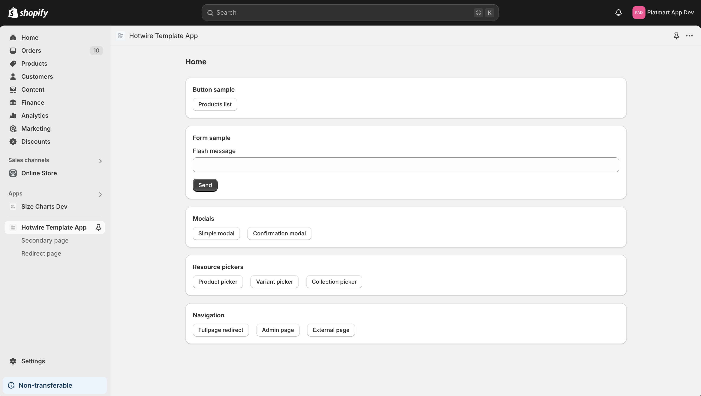

# Shopify Hotwire Template

Welcome to the new template for building Shopify apps with Hotwire. This repo is successor of [Shopify Hotwire Sample](https://github.com/kirillplatonov/shopify-hotwire-sample) but available only for my Github Sponsors. It's will be more frequently updated to keep up with Shopify changes.

Please avoid sharing this repo with anyone else. If you want to share it with your team members, please ask them to [sponsor me on Github](https://github.com/sponsors/kirillplatonov).

The template includes:
- JWT integration for [Hotwire Turbo](https://turbo.hotwired.dev/)
- JWT integration for [Rails Request.JS](https://github.com/rails/request.js)
- Integration with AppBridge 4
- Integration with Shopify CLI 3
- [Polaris ViewComponents](https://github.com/baoagency/polaris_view_components)
- [Hotwire::Livereload](https://github.com/kirillplatonov/hotwire-livereload)



## Dependencies

- Redis
- Postgres

## Quick start

To run this sample locally, you can clone this repository and follow these steps:

1. Rename databases in `config/database.yml` to match your app name.

2. Install dependencies:

```shell
bundle install
yarn install
```

3. Connect to Shopify app:

```shell
yarn run config link
```

This will create `shopify.app.toml` file with development configuration. All CLI commands will use this file by default unless you specify another one with `-c` or `--config=` option. Please note that if you link another config file it will become new default for CLI command and you can switch it by running `yarn run config use shopify.app.toml`.

4. Setup Rails app:

```
bin/setup
```

Note that there currently exists two options for releasing an App. _Custom_ or _Public_. If you choose the custom app option, the Shopify Billing API is considered off limits and not valid to use or make calls to. Therefore the controller **authenticated_controller.rb** needs to have the **before_action :check_subscription** (currently line 10) commented out to ensure the installation process can proceed. 


5. Launch the app:

```shell
yarn dev
```

## Billing

This sample uses simple billing configuration provided by `shopify_app` gem. You can configure it in `config/initializers/shopify_app.rb` using `config.billing` setting.

> **NOTE: Make sure to select public distribution for your app in Shopify Partner Dashboard. Otherwise, billing will not work and you'll get an error when trying to open app.**

## Production deployment

1. Generate config for production app:

```shell
yarn run config link
```

When asked for `Configuration file name` type `production`. This will create `shopify.app.production.toml` file with production configuration. You can edit it and deploy config changes to production app using:

```shell
yarn deploy -c production
```

2. Update `application_url` and `redirect_urls` in `shopify.app.production.toml` to match your production app domain.

```toml
application_url = "https://MY-APP-NAME.herokuapp.com/"

[auth]
redirect_urls = [ "https://MY-APP-NAME.herokuapp.com/auth/shopify/callback" ]
```

3. Deploy config changes to Shopify:

```shell
yarn deploy -c production
```

4. Switch your dev environment to development config:

```shell
yarn run config use shopify.app.toml
```

5. Setup environemnt variables in your hosting provider.

To run your app on Heroku you need to setup the following env vars:
- `SHOPIFY_API_KEY`
- `SHOPIFY_API_SECRET`
- `HOST` (example `https://MY-APP-NAME.herokuapp.com`)

You can get Shopify keys with the following command:

```shell
yarn run env show -c production
```

## Permanent Cloudflare tunnel

To avoid app URL changes on every server start you can use Cloudflare Tunnel with custom domain **for free**. To create your tunnel follow this guide:
https://kirillplatonov.com/posts/setting-up-cloudflare-tunnel-for-development/

Once you have your tunnel update `yarn dev` command in `package.json` to use your tunnel domain:

```json
"dev": "shopify app dev --tunnel-url https://YOUR_TUNNEL_DOMAIN:443",
```

If you want to use server port different from 3000 you need specify it in few places:

- `bin/tunnel`
- `Procfile.dev`
- `shopify.web.toml`

## Running tests

Before running test make sure to set `TEST_STORE_DOMAIN` and `TEST_STORE_TOKEN` in `.env`. In real app you can move these variables to Rails credentials and update shop fixture in `test/fixtures/shops.yml`.

```bash
bin/rails test:all
```
